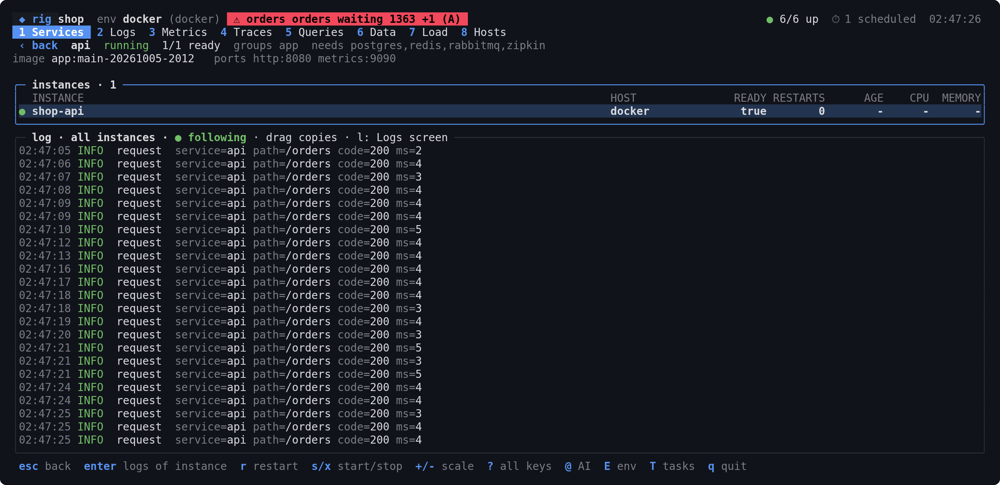
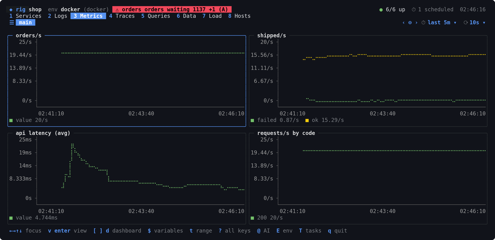
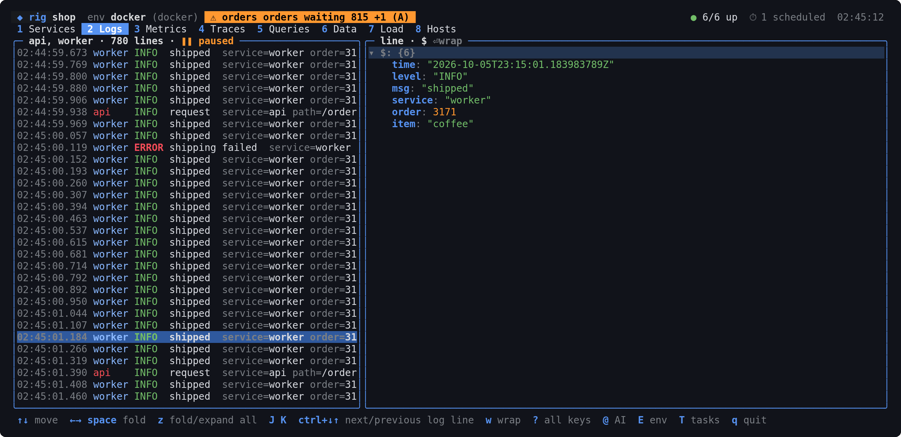
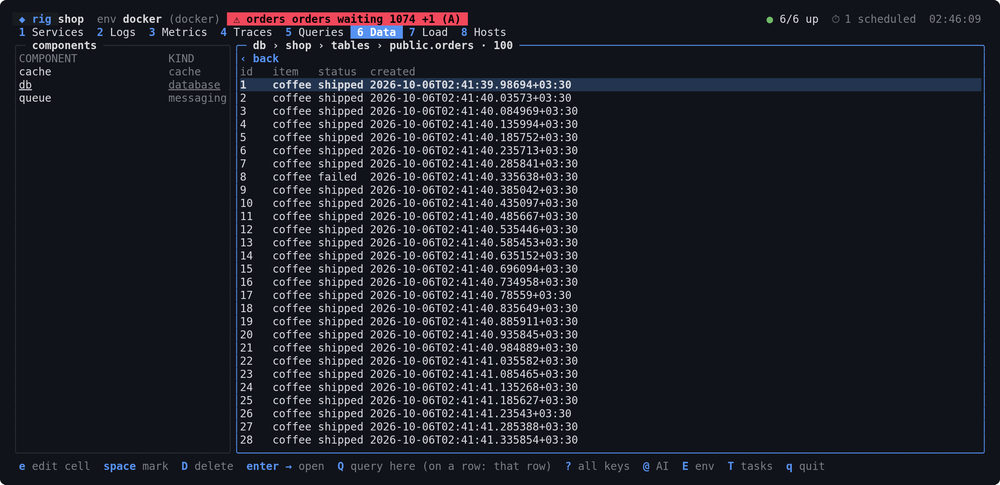
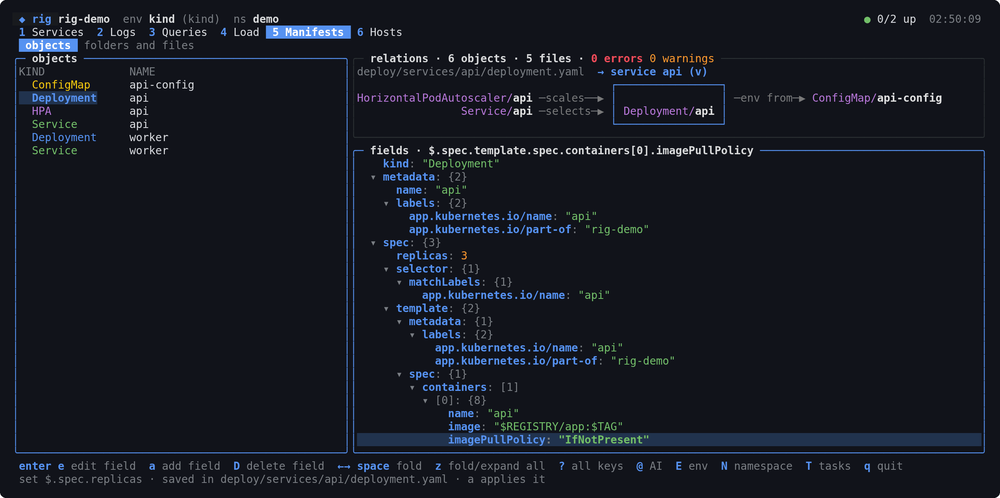

# rig

[](https://github.com/goxang/rig/actions/workflows/ci.yml)
[](https://github.com/goxang/rig/releases/latest)

**The AI-integrated pilot for every service you run.** Manage every part of your software from the terminal:
services, infrastructure, data, Kubernetes, logs, metrics, tests. Local processes, docker or Kubernetes;
Go, Python, Node, Java, Rust or anything that runs. Describe it once in `rig.yaml`, then run, watch and tune
it all from one CLI and one terminal UI.

- **Plugin-based**: every runtime, database, broker, metrics or logs backend is an adapter behind one
  registry. New components plug in without touching the core, and contributions are welcome.
- **AI built in**: `@` on any screen chats about what it shows and can act on it; query prompts get AI
  autocomplete. Works with opencode (free models, no login needed), Claude Code, OpenAI or any
  OpenAI-compatible endpoint, Anthropic, DeepSeek and 9router.



| | |
|---|---|
|  |  |
|  |  |
|  | |

## What it does

- **Run**: up in dependency order, start, stop, restart, scale, build, deploy, exec, debug
- **Watch**: merged logs you can query by field, Grafana-style dashboards, traces, alerts
- **Data**: browse and edit databases, Redis, RabbitMQ, Kafka, key-value config; saved queries on a schedule
- **Kubernetes**: manifests as a graph, edited field by field, synced from the cluster; HPAs, namespaces
- **Test and load**: test suites with live results, load generators with rate and instances
- **AI**: `@` chat on every screen, inline query completions, `@?` plain-language queries; `rig mcp` gives
  agents every tool
- **Any stack**: not just Go; Python, Node, Java, Rust, any image or binary; `rig init` reads compose files,
  manifests and sources

## Install

```bash
curl -fsSL https://raw.githubusercontent.com/goxang/rig/main/install.sh | sh
```

Linux and macOS (amd64, arm64). Windows: the `.zip` on the [releases page](https://github.com/goxang/rig/releases).
With Go 1.23+: `go install github.com/goxang/rig/cmd/rig@latest`.

## Start

```bash
rig init      # rig.yaml from what the project has: compose, manifests, sources
rig doctor    # what is missing: tools, cluster or daemon, variables, ports, components
rig up        # everything, in dependency order
rig           # the terminal UI; ? lists the keys of every screen
```

On a project that already has a `rig.yaml`: `rig env` lists its environments, `-e <name>` picks one.

A small `rig.yaml`:

```yaml
project: shop
default: docker

services:
  api:
    depends_on: [db]
    build: { go: ./cmd/api }
    ports: { http: 8080, metrics: 9090 }
    health: { port: http, path: /healthz }
  db: { role: infra, image: "postgres:17", ports: { pg: 5432 } }

environments:
  docker: { runtime: { type: docker } }
  kind:   { runtime: { type: kind, cluster: shop, manifests: [deploy] } }

components:
  db: { type: sql, driver: postgres, addr: "svc://db:5432", user: app, password: "${DB_PASSWORD}" }
```

Try one of the [examples](examples): `cd examples/shop && rig up && rig`.

## Docs

- [Guide](docs/guide.md): CLI, every screen and its keys, AI, GoLand, agents
- [Config](docs/config.md): every `rig.yaml` key
- [Design](docs/design.md): how rig is built, writing an adapter
- [Manifests](docs/manifests.md): a manifest layout that works well with rig

All of it ships in the binary too: `rig docs guide`.

## Contributing

rig is open to contributions: new adapters, screens, fixes, docs. [Design](docs/design.md) shows how to
write an adapter. `go vet ./... && go test -race ./...` must pass. Commits follow Conventional Commits; every green push
to `main` is released (`feat:` minor, anything else patch).

## License

[Apache 2.0](LICENSE)
